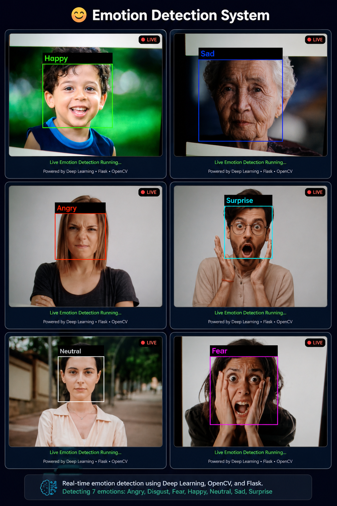

# 😊 Human Emotion Detection System

> A real-time Human Emotion Detection System built using **Deep Learning**, **Computer Vision**, **TensorFlow**, **OpenCV**, and **Flask**.


---

## 📌 Overview

The **Human Emotion Detection System** is a real-time facial expression recognition application that uses **Convolutional Neural Networks (CNN)** to classify human emotions from live webcam video.

The application detects faces using **OpenCV Haar Cascade**, predicts emotions using a trained **TensorFlow/Keras CNN model**, and provides **voice feedback** through **pyttsx3**. A user-friendly **Flask web interface** displays live emotion predictions.

---

## 🎯 Features

- 🎥 Real-time webcam-based emotion detection
- 😀 Detects **7 different human emotions**
- 🧠 CNN-based Deep Learning model
- 👤 Face detection using Haar Cascade Classifier
- 🔊 Voice feedback using Text-to-Speech
- 🌐 Flask Web Application
- 🎨 Color-coded emotion labels
- ⚡ Live video streaming

---

## 😊 Emotions Detected

- 😀 Happy
- 😢 Sad
- 😠 Angry
- 😨 Fear
- 😲 Surprise
- 😐 Neutral
- 🤢 Disgust

---

## 🛠️ Tech Stack

### Programming Language

- Python

### Deep Learning

- TensorFlow
- Keras

### Computer Vision

- OpenCV

### Web Framework

- Flask

### Libraries

- NumPy
- pyttsx3
- Threading

---

## 📂 Project Structure

```
Human-Emotion-Detection-System/
│
├── dataset/
│
├── model/
│   ├── emotion_model.h5
│   └── haarcascade_frontalface_default.xml
│
├── static/
│   └── style.css
│
├── templates/
│   └── index.html
│
├── app.py
├── train_model.py
├── requirements.txt
├── README.md
└── LICENSE
```

---

## 🔄 System Workflow

```
FER2013 Dataset
        │
        ▼
Data Preprocessing
        │
        ▼
CNN Model Training
        │
        ▼
Saved Model (.h5)
        │
        ▼
Webcam Input
        │
        ▼
Face Detection
(OpenCV Haar Cascade)
        │
        ▼
CNN Emotion Prediction
        │
        ▼
Display Emotion
        │
        ▼
Voice Feedback
```

---

## 🧠 CNN Architecture

```
Input Image (48×48×1)

↓

Conv2D (32)

↓

MaxPooling

↓

Conv2D (64)

↓

MaxPooling

↓

Conv2D (128)

↓

MaxPooling

↓

Flatten

↓

Dense (128)

↓

Dropout (0.5)

↓

Dense (7)

↓

Softmax

↓

Emotion Prediction
```

---

## 📊 Dataset

**FER2013 Facial Expression Dataset**

- Image Size: **48 × 48**
- Grayscale Images
- 7 Emotion Classes

Dataset Classes:

- Angry
- Disgust
- Fear
- Happy
- Neutral
- Sad
- Surprise

---

## 🚀 Installation

### Clone Repository

```bash
git clone https://github.com/YOUR_USERNAME/Human-Emotion-Detection-System.git
```

### Open Project

```bash
cd Human-Emotion-Detection-System
```

### Install Dependencies

```bash
pip install -r requirements.txt
```

### Run Application

```bash
python app.py
```

Open your browser and visit:

```
http://127.0.0.1:5000
```

---

## 📸 Screenshots

### Emotion Detection Output




---

## 💡 Applications

- Human-Computer Interaction
- Mental Health Monitoring
- Smart Surveillance
- Customer Behaviour Analysis
- E-learning Systems
- Gaming Applications
- AI Assistants

---

## 🔮 Future Enhancements

- Mobile Application
- Multiple Face Detection
- EfficientNet Integration
- MobileNetV3 Implementation
- Cloud Deployment
- Emotion Analytics Dashboard
- REST API
- Improved Model Accuracy

---

## 👨‍💻 Author

**Mohan Ugale**

B.E. Artificial Intelligence & Data Science

Pune Vidyarthi Griha's College of Engineering & S.S. Dhamankar Institute of Management, Nashik

---

## ⭐ Support

If you found this project helpful, please consider giving it a ⭐ on GitHub.

---

## 📜 License

This project is licensed under the **MIT License**.
